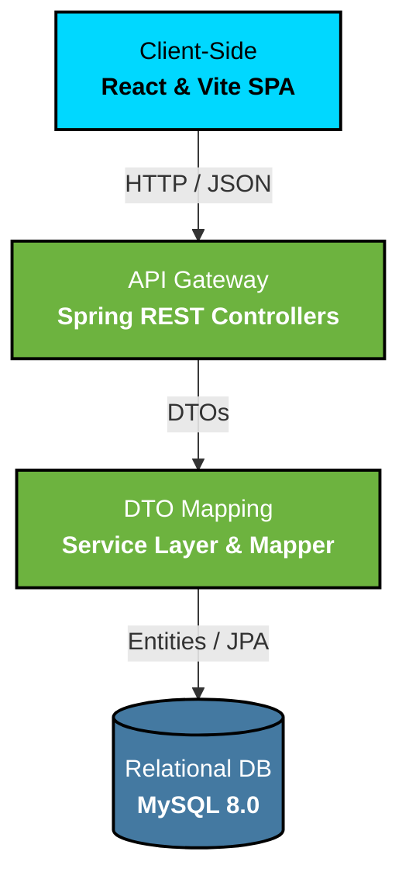

<div align="center">
  

  <h1>RestaurantIQ</h1>
  <p><b>Enterprise-Grade Restaurant Inventory Management System</b></p>
  <p><em>Automated expiry tracking, dynamic cost calculations, and immutable audit trails.</em></p>

  <div>
    
    
    
    
    <br/>
    
    
  </div>
</div>

---

## 🔗 Quick Links

| Resource | URL |
|----------|-----|
| 🌐 **Live Application** | [RestaurantIQ Vercel App](https://restaurant-inventory-management-sys-six.vercel.app) |
| 🔌 **Backend API** | [Railway Production API](https://restaurant-inventory-management-system-production.up.railway.app/api/dashboard/summary) |
| 📂 **Repository** | [GitHub Source Code](https://github.com/BalakrishnaKini/restaurant-inventory-management-system) |
| 🎥 **Demo Video** | *(Video coming soon)* |

---

## 🎯 Executive Summary

**RestaurantIQ** bridges the gap between simple CRUD operations and real-world financial tracking. Designed to solve critical restaurant logistics, it eliminates manual stock errors, automates expiry warnings, and introduces dynamic **Weighted Average Costing (WAC)** to ensure completely accurate inventory valuation.

---

## ✨ Feature Matrix

| Category | Key Features | Capabilities |
|----------|-------------|--------------|
| 📊 **Analytics** | Dashboard & KPIs | Real-time valuation, low-stock alerts, out-of-stock monitoring, trend visualization. |
| 📦 **Inventory** | Core Management | Add/Edit/Delete items, granular unit tracking, active category filtering. |
| 🛒 **Procurement** | Purchase Orders | End-to-end PO lifecycle, automated stock increment upon receipt. |
| 💰 **Financials** | Dynamic WAC | Automatic recalculation of unit prices when receiving new stock at different price points. |
| ⏳ **Health** | Expiry Tracking | Automated timezone-aware categorization (Fresh, Expiring Soon, Expires Today, Expired). |
| 📜 **Auditing** | Immutable Logs | Comprehensive historical ledger tracking every addition, reduction, and manual adjustment. |

---

## 🏗️ System Architecture

RestaurantIQ utilizes a decoupled **DTO (Data Transfer Object)** architecture to ensure strict separation of concerns between database entities and client-facing REST APIs.



---

## 📸 Visual Showcase

<table>
  <tr>
    <td width="50%">
      <b>1. Analytics Dashboard</b><br/>
      
    </td>
    <td width="50%">
      <b>2. Inventory Management</b><br/>
      
    </td>
  </tr>
  <tr>
    <td width="50%">
      <b>3. Purchase Orders Workflow</b><br/>
      
    </td>
    <td width="50%">
      <b>4. Immutable Audit History</b><br/>
      
    </td>
  </tr>
  <tr>
    <td width="50%">
      <b>5. Category Management</b><br/>
      
    </td>
    <td width="50%">
      <b>6. Supplier Directory</b><br/>
      
    </td>
  </tr>
  <tr>
    <td width="50%">
      <b>7. Exportable Reports</b><br/>
      
    </td>
    <td width="50%">
      <b>8. Authentication</b><br/>
      
    </td>
  </tr>
</table>

---

## 🛠️ Technology Stack

| Domain | Technologies Used |
|--------|-------------------|
| **Frontend** | React 18, Vite, React Router DOM, Recharts, Axios |
| **Backend** | Java 21, Spring Boot 3.x, Spring Data JPA, Hibernate |
| **Database** | MySQL 8.0 |
| **Deployment**| Vercel (Frontend edge network), Railway (Backend & DB) |

---

## ⚙️ Local Setup Instructions

### Prerequisites
* **Java 21**
* **Node.js 18+**
* **MySQL 8.0+**
* **Maven**

### 1. Database Initialization
Create a new local MySQL database:
```sql
CREATE DATABASE restaurant_inventory;
```

### 2. Backend Startup
Configure your local database credentials in `backend/src/main/resources/application.properties`, then run:
```bash
cd backend
mvn spring-boot:run
```

### 3. Frontend Startup
In a separate terminal window, initialize the Vite dev server:
```bash
cd frontend
npm install
npm run dev
```

---

## 📚 Additional Documentation

* [**Backend API Documentation**](backend/README.md) - Deep dive into the Spring Boot architecture, WAC algorithm, and REST endpoints.

---

## 👨‍💻 Author

**Balakrishna Kini**

[](https://linkedin.com/in/balakrishna-kini)
[](https://github.com/Balakrishna-kini)
[](mailto:balakrishnakini22@gmail.com)
