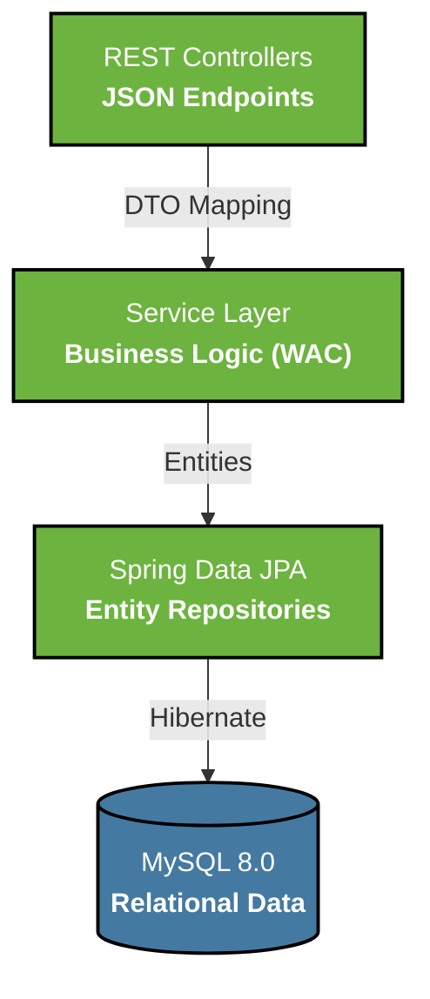

<div align="center">
  

  <h1>RestaurantIQ Backend Service</h1>
  <p><b>Spring Boot 3.x REST API Layer</b></p>

  <div>
    
    
    
    <br/>
    
  </div>
</div>

---

## 🔗 Live Production API
**Endpoint:** [https://restaurant-inventory-management-system-production.up.railway.app/api/dashboard/summary](https://restaurant-inventory-management-system-production.up.railway.app/api/dashboard/summary)

---

## 🎯 Architecture Overview

This backend is the engine powering RestaurantIQ. It handles database persistence, dynamic valuation algorithms, and enforces strict data integrity via a decoupled DTO layer.



---

## ✨ Core Backend Responsibilities

| Subsystem | Responsibility |
|-----------|----------------|
| **DTO Mapper** | Strictly isolates internal JPA entities from API consumers, ensuring precise JSON payload delivery. |
| **WAC Engine** | Intercepts fulfilled Purchase Orders to dynamically recalculate aggregate unit pricing across the inventory. |
| **Audit Interceptor** | Automatically listens for stock alterations and commits immutable logs to the `StockHistory` table. |
| **KPI Aggregator** | Offloads complex counting algorithms (Expiry, Out of Stock, Value) from the client to the server via `/api/dashboard/summary`. |

---

## ⚙️ Local Development

### Prerequisites
* Java 21
* MySQL 8.0+
* Maven

### Setup
1. Create a MySQL database named `restaurant_inventory`.
2. Configure `src/main/resources/application.properties` with your credentials:
   ```properties
   spring.datasource.username=root
   spring.datasource.password=your_password
   ```
3. Run the application:
   ```bash
   mvn spring-boot:run
   ```

---

## 👨‍💻 Author

**Balakrishna Kini**

[](https://linkedin.com/in/balakrishna-kini)
[](https://github.com/Balakrishna-kini)
[](mailto:balakrishnakini22@gmail.com)
